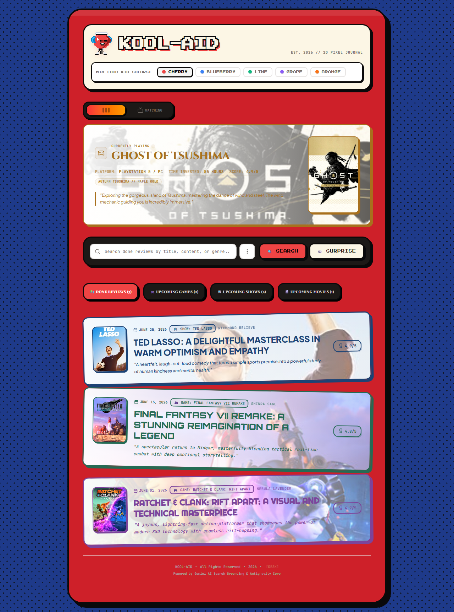
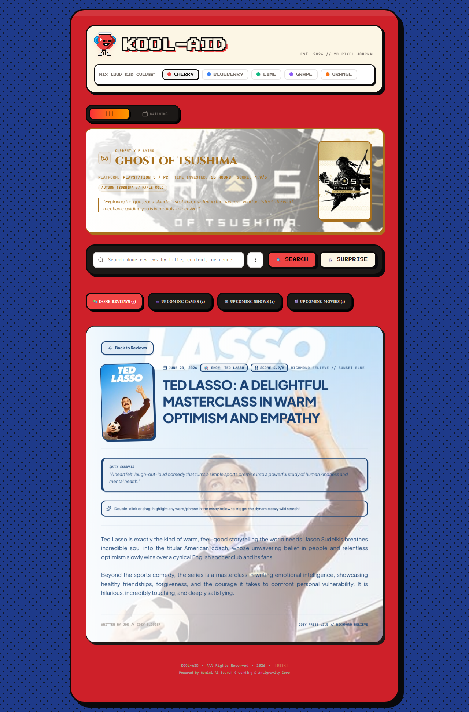

# Kool-Aid 🍒

A retro, pixel-styled personal blog for tracking what you're playing, watching, and reviewing — games, movies, and TV shows all in one cozy 2D journal.

Built with React + Vite on the frontend and a small Express server that talks to Google's Gemini API (plus RAWG and OMDB) to auto-fetch cover art, synopses, and details when you add something new.

## Screenshots

**Home feed** — a "currently playing / currently watching" hero card, done reviews, and an upcoming-releases tracker, all wrapped in a hand-drawn cartridge frame:



**Review detail view** — each title gets its own color theme generated from its name:



## Features

- **Currently Playing / Currently Watching** hero panel with a draggable slider to flip between the two
- **Done Reviews** feed with full write-ups, ratings, and per-title generated color themes (e.g. a Ghibli film gets a soft watercolor-green theme, a horror game gets a gothic ash theme)
- **Backlog and Upcoming** tabs for games, shows, and movies you're planning to check out
- **Live search grounding** — type a title and the server looks it up via Gemini, RAWG (games), and OMDB (movies/shows) to pull in real cover art and synopsis text
- **Admin hub** for adding reviews, backlog entries, and video embeds, and for updating what's currently playing/watching
- **Customizable mascot** — recolor the Kool-Aid Man mascot with a few preset flavors
- Data is persisted client-side in `localStorage`, so your blog content survives refreshes without a database

## Tech stack

- [React 19](https://react.dev/) + [Vite 6](https://vitejs.dev/)
- [Express](https://expressjs.com/) (dev/prod server, also proxies the search API)
- [Tailwind CSS 4](https://tailwindcss.com/)
- [Motion](https://motion.dev/) for animation
- [`@google/genai`](https://www.npmjs.com/package/@google/genai) (Gemini API) for title lookups, synopses, and ratings
- [RAWG](https://rawg.io/apidocs) for game metadata, [OMDB](https://www.omdbapi.com/) for movie/show metadata

## Run locally

**Prerequisites:** Node.js

1. Install dependencies:
   ```bash
   npm install
   ```
2. Copy `.env.example` to `.env` and fill in your keys:
   ```bash
   cp .env.example .env
   ```
   | Variable | Used for |
   |---|---|
   | `GEMINI_API_KEY` | Gemini API calls (title lookups, review generation) |
   | `API_GAME_BRAIN` | RAWG API key, for live game search |
   | `OMDB_API_KEY` | OMDB API key, for live movie/show search |
   | `APP_URL` | Base URL of your deployment (self-referential links) |
3. Run the app:
   ```bash
   npm run dev
   ```
   The app serves on [http://localhost:3000](http://localhost:3000).

Everything works without the API keys too — the blog loads with its built-in sample data — but the search/auto-fetch features that pull live cover art and synopses need them.

## Project structure

```
server.js            Express server: static/dev serving + /api/blog/search-game
src/
  App.jsx             Main app: hero panel, reviews, upcoming tabs, admin hub
  components/
    KoolAidMascot.jsx  The recolorable mascot SVG
  data/
    blogData.js        Default seed data (reviews, backlog, upcoming items)
vite.config.js        Vite dev/build config
```
